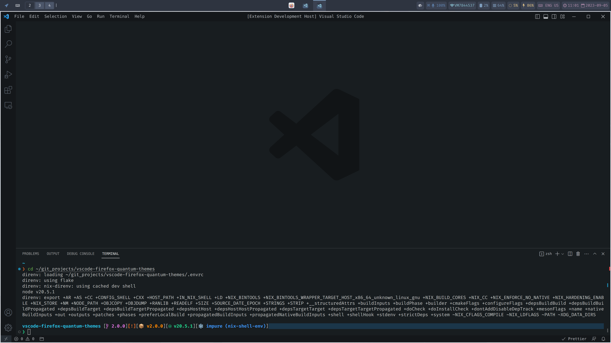
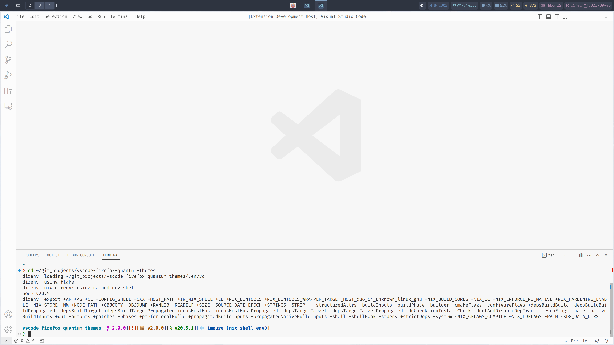

# Firefox Quantum Themes

The Firefox Quantum Themes for [Visual Studio Code](https://code.visualstudio.com) are inspired by the colours used in Firefox Quantum's DevTools. Using the exact same colours Mozilla use for the chrome and syntax highlighting in the DevTools, I've put together a beautifully dark and light theme. This theme is open-source and will forever be open-source. Anyone is welcome to submit PRs, open issues etc. I would love to hear your feedback! Look below for more information. For Firefox users, this theme will be especially pleasing to use!

## UI Screenshots

For some syntax highlighting examples, see [SCREENSHOTS.md](./SCREENSHOTS.md)

### Supported Languages

By "supported languages", I mean languages where the syntax highlighting doesn't look (too) terrible and is readable.

- Batch/Shell/PowerShell/conf
- C/C++/C# (with their respective extensions)
- Clojure
- CoffeeScript
- CSS/SASS/SCSS/LESS
- Dart
- Dockerfile (with the `jeff-hykin.better-dockerfile-syntax` extension)
- F# (Limited support). Tested with the extension `Ionide for F#: ionide.ionide-fsharp`.
- Go
- GraphQL (with extension `graphql.vscode-graphql-syntax`)
- HTML
- Java
- JavaScript
- JSON/C
- JSX
- Julia
- LAMMPS (with `thfriedrich.lammps`)
- Lua
- Nix (with `jnoortheen.nix-ide`)
- PHP
- Pug
- Python (with Python extension)
- Ruby
- Rust (via `rust-lang.rust-analyzer`)
- SQL
- TeX/LaTeX/BiBTeX (with extension `james-yu.latex-workshop`)
- TOML (with extension `tamasfe.even-better-toml`)
- TypeScript
- Vue (with extension `vue.volar`)
- XML (with extension `dotjoshjohnson.xml`)
- YAML

## [Changelog](https://github.com/chpxu/vscode-firefox-quantum-themes/blob/master/CHANGELOG.md)

## Theme Colours

For the colours used, please refer to the [Mozilla Developer Network](https://developer.mozilla.org/en-US/docs/Tools/DevToolsColors) for the most up-to-date information.

Here is the quick summary of colours used:

| Dark Hex  | Dark RGBA                 | Light Hex | Light RGBA               |
| --------- | ------------------------- | --------- | ------------------------ |
| `#252c33` | `rgba(37, 44, 51, 1)`     | `#ebeced` | `rgba(235, 236, 237, 1)` |
| `#343c45` | `rgba(52, 60, 69, 1)    ` | `#f0f1f2` | `rgba(240, 241, 242, 1)` |
| `#1d4f73` | `rgba(29, 79, 115, 1)   ` | `#4c9ed9` | `rgba(76, 158, 217, 1)`  |
| `#5c6773` | `rgba(92, 103, 115, 1)  ` | `#747573` | `rgba(116, 117, 115, 1)` |
| `#14171a` | `rgba(17, 19, 21, 1)    ` | `#fcfcfc` | `rgba(252, 252, 252, 1)` |
| `#181d20` | `rgba(24, 29, 32, 1)    ` | `#f7f7f7` | `rgba(247, 247, 247, 1)` |
| `#8fa1b2` | `rgba(143, 161, 178, 1) ` | `#18191a` | `rgba(24, 25, 26, 1)`    |
| `#b6babf` | `rgba(182, 186, 191, 1) ` | `#585959` | `rgba(88, 89, 89, 1)`    |
| `#46afe3` | `rgba(70, 175, 227, 1)  ` | `#0088cc` | `rgba(0, 136, 204, 1)`   |
| `#6b7abb` | `rgba(107, 122, 187, 1) ` | `#5b5fff` | `rgba(91, 95, 255, 1)`   |
| `#df80ff` | `rgba(223, 128, 255, 1) ` | `#b82ee5` | `rgba(184, 46, 229, 1)`  |
| `#eb5368` | `rgba(235, 83, 104, 1)  ` | `#ed2655` | `rgba(237, 38, 85, 1)`   |
| `#d96629` | `rgba(217, 102, 41, 1)  ` | `#f13c00` | `rgba(241, 60, 0, 1)`    |
| `#d99b28` | `rgba(217, 155, 40, 1)  ` | `#d97e00` | `rgba(217, 126, 0, 1)`   |
| `#70bf53` | `rgba(112, 191, 83, 1)  ` | `#2cbb0f` | `rgba(44, 187, 15, 1)`   |
| `#5e88b0` | `rgba(94, 136, 176, 1)  ` | `#0072ab` | `rgba(0, 114, 171, 1)`   |
| `#ffffb4` | `rgba(255, 255, 180, 1)`  | `#ffffb4` | `rgba(255, 255, 180, 1)` |

## Current known differences

See [Differences.md](./DIFFERENCES.md)

## Theme Suggestions

- Have Colourised Bracket pairs enabled.
  - Don't theme it to the same colours as this theme, most colours should work well.
  - Brackets will be much clearer.
- Enable font ligatures if you have a font which supports them.

## Contribution

I currently work on this theme in my spare time. As of writing, it is available in the Marketplace. As a new developer, I am still attempting to work things out, thanks!

If editing and wanting to submit a pull request, please ensure that as much sufficient detail is provided, and briefly state your changes and why, or if meant to fix an issue, reference the problem alongside it.

As of `v2.0.0`, I have changed how the theme files are generated. Upon opening the theme files `Quantum Light.json` and `Quantum Dark.json`, you will see the properties organised terribly. This is because the theme files are generated at the run of a command.

- The files `Quantum Light old.json` and `Quantum Dark old.json` are the legacy theme values (`v1.2.0`). This was for comparison's sake when developing `v2`.

To build and test your modifications, follow these steps:

1. Clone the repository. Have direnv, NodeJS and Yarn installed.
2. Run `direnv allow .`. Then install the dependencies with `yarn install`.
3. You will spend most of your time in the `src` directory. This contains a few TypeScript files:
   - `Types.ts` is a file containing interfaces used to validate variables and functions throughout the project. This will never be edited unless you are wanting to change part of the architecture of the theme.
   - `colours.ts` is the file which contains the colour objects used in the theme.
   - `generator.ts` contains the functions used to generate the theme files.
   - `scopes.ts` contains the attributes to be themed. You will most likely be editing this file a lot to move/add things.
   - `generate.ts` contains all the function callas and post-processing for the theme files. You may be editing this a lot too to call functions with different parameters.
4. In a terminal, run `npm run generate`. This will add theme files to `./themes`. Under the hood, this command runs `ts-node ./src/generate.ts`.
5. Press `F5` (or whatever shortcut you have to debug extensions) and the Extension Host will open up with the new theme files applied. Please ensure you run the generate command after making any changes.

If you wish to lint, you can run `npm run lint`.

### Repo vs Marketplace

The marketplace version always contains the **stable** version of this theme (i.e., whatever is the Published (i.e., exists in Releases) version). The repsitory here on GitHub also contain development pushes (which aren't published on the Marketplace, but tagged on GitHub).

To run these development pushes, follow the Contribution section above.

If you wish to "daily drive" these development pushes, follow the Contribution section, and then:

1. Install the extension from VSCode marketplace regularly
2. Follow Contribution above, in a different directory
3. Copy and paste your generated theme files in `./themes` (in the development version) to the `./themes` in the `extensions` folder of your VSCode install.
4. Restart VSCode
5. If the theme then says a reload is required, DO NOT press it unless you want to reset the extension to stable.
6. Otherwise if you want to go back to stable, uninstall then reinstall the extension

## Thank You's!

This theme was heavily inspired by Firefox DevTools, as well as the [One Dark Pro Port](https://github.com/Binaryify/OneDark-Pro) and VSCode itself! Thanks to them all for the ideas :)

And the following:

- [**@compilenix**](https://github.com/compilenix): First person to show interest and BETA TESTER

- All of you who have even just glanced!

## License

[MIT License](https://github.com/beastdestroyer/vscode-firefox-quantum-themes/blob/master/LICENSE.txt)

Wow, this extension dates back to VSCode 1.26.0!
