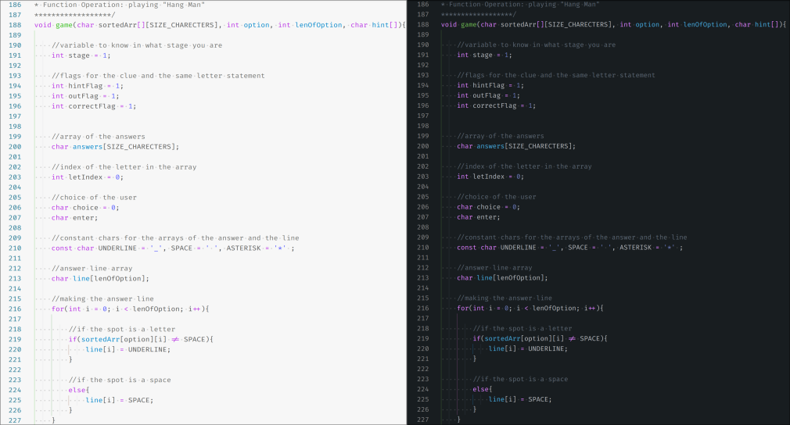
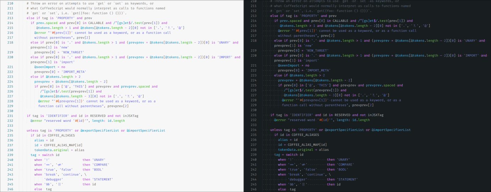
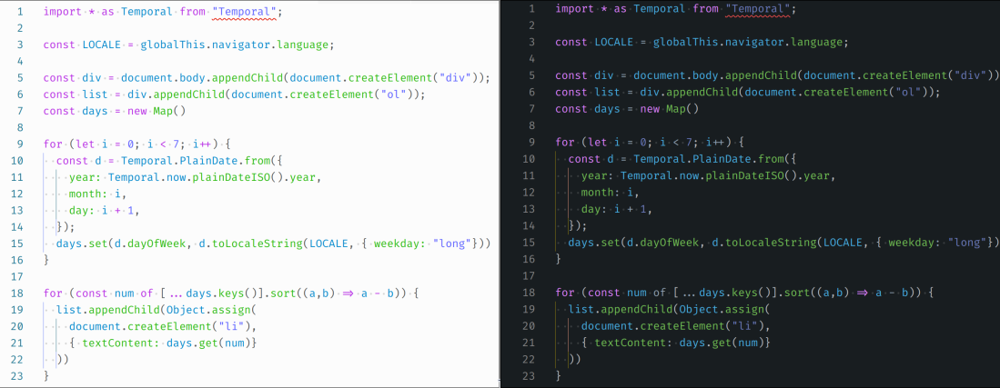

## Screenshots:

Here are the latest screenshots of this theme. This is in the layout of `Dark` on the right and `Light` on the left.
Please note, the code presented here is 100% not mine, and was copied from open-source projects. All sources to these projects have been credited.

### Batch

[Batch code source](https://github.com/Archive-projects/Batch-File-examples/blob/master/files/tf5.bat)

### C

### C++

### C#

[C# code source](https://github.com/dockersamples/example-voting-app/blob/main/worker/Program.cs)

### CSS

### Clojure

### CoffeeScript

### Dart

### HTML

### JSON/C

### JavaScript/React

### Markdown

### PHP

### SCSS

### SQL

### TypeScript/React

