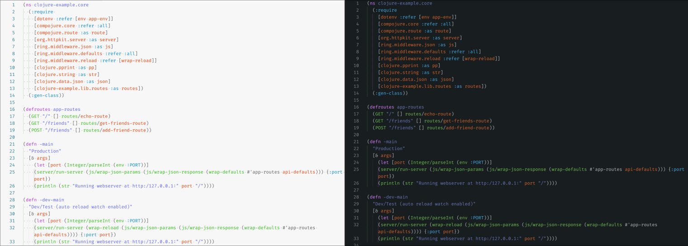

## Screenshots:

Here are some screenshots of this theme.

Please note, the code presented here is 100% not mine, and was copied from open-source projects. All sources to these projects have been credited.

### Batch

[Batch code source](https://github.com/Archive-projects/Batch-File-examples/blob/master/files/tf5.bat)

### C

[C code source](https://github.com/TalMizrahii/Hangman-game/blob/main/Hangman.c)

### C++

### C#

[C# code source](https://github.com/dockersamples/example-voting-app/blob/main/worker/Program.cs)

### CSS

Source: original.

### Clojure

[Clojure code source](https://github.com/kenreilly/clojure-example/blob/master/src/clojure_example/core.clj)

### CoffeeScript

[CoffeeScript code source](https://github.com/jashkenas/coffeescript/blob/main/src/lexer.coffee)

### Dart

[Dart code source](https://github.com/dart-lang/samples/blob/main/isolates/bin/long_running_isolate.dart)

### Dockerfile

[Dart code source](https://github.com/dockersamples/example-voting-app/blob/main/worker/Dockerfile)

### F#

[F# code source](https://github.com/bigby-the-wolf/WebApiTest/blob/master/WebApiTest.Domain/Operations/AccountOperations.fs)

### Go

[Go code source](https://github.com/golang/example/blob/master/hello/hello.go)

### HTML

Source: original.

### JSON/C

Source: my VSCode settings.

### JavaScript

Source: [Wikipedia](https://commons.wikimedia.org/wiki/File:JavaScript_code.png)

### Markdown

Source: original.

### PHP

Source: unknown.

### Python

Source: from my Physics research project.

### SCSS

### SQL

### TypeScript/React

Source: this repository: `./src/colours.ts`.
